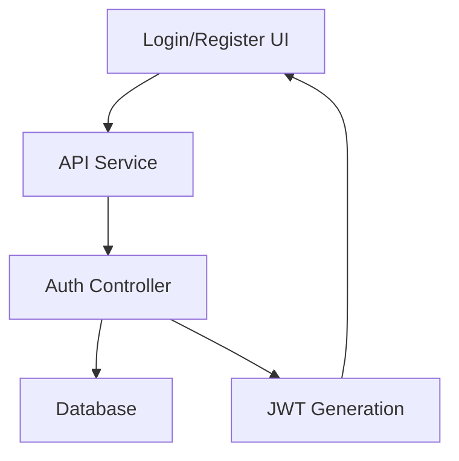
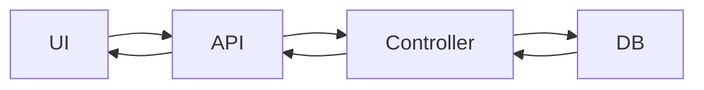

# ManageMate Architecture

## Core Modules

### Authentication Flow

### Data Flow

## Key Decisions
- JWT for stateless auth
- Zod for runtime validation
- Modular feature organization
- Error boundaries for UI resilience
